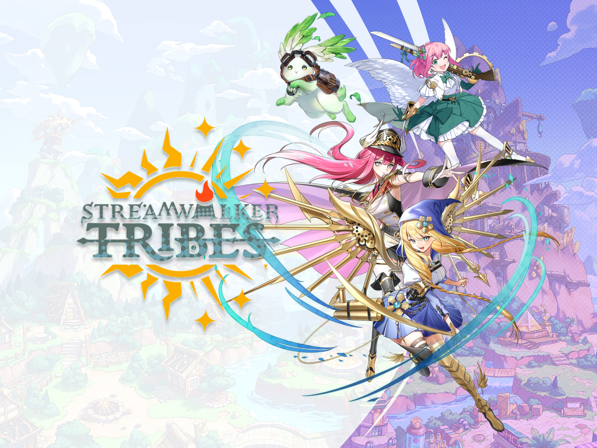

# yuli's portfolio

個人作品集網站 · 日式水墨風格 · 響應式雙分頁架構

---

## 檔案結構

```
yuli-portfolio/
├── index.html            主要檔案 · 所有圖片位置為空白，供填入你的真實作品
├── index-demo.html       示範版 · 已用 picsum.photos 填入 27 張測試圖片
├── README.md             本檔案 · 專案總覽、快速開始、部署指南
├── IMAGES.md             圖片規格詳細說明 · 尺寸原理、優化流程、格式建議
└── images/               你的作品圖片放這裡
    └── README.md         圖片檔名對照表與命名規則
```

---

## 三分鐘快速上手

### Step 1 · 預覽網站
用瀏覽器直接開啟 `index-demo.html`——立刻看到帶示範圖片的完整成品效果。

### Step 2 · 開始編輯
用 VS Code（或任何文字編輯器）開啟 `index.html`。在檔案內搜尋 `★ 可編輯` 找到所有可修改的位置。主要包含：

- 首頁自我介紹段落、能力標籤
- 六個專案的標題、日期、類型、內文敘述
- 時間軸中的 `[Company Name]` 佔位符（替換為實際公司名）
- 教學經歷、專長、業界認可條目
- 聯絡方式（Email、社群連結）
- 印章文字（預設「游墨」）

### Step 3 · 加入你的圖片
1. 把作品圖片放進 `images/` 資料夾（規格見 `IMAGES.md`）
2. 檔名依照 `data-slot` 命名（例如 `streamwalker-01.jpg`）
3. 在 HTML 對應位置加入 `` 標籤：

```html
<div class="image-placeholder ..." data-slot="streamwalker-01">
  
  ... (原本的佔位符文字保留即可，CSS 會自動隱藏)
</div>
```

---

## 網站架構總覽

### 五個分頁
| 分頁 | 內容 |
|---|---|
| **Home** | 個人簡介、三項統計、六項能力標籤、進入雙分頁按鈕 |
| **Game Art** | 三個遊戲美術專案（Streamwalker Tribes、Ali Baba、Legend of Pirate）|
| **Project Manager** | 三個 PM 專案（XA Data Push、Custom Sales、Brand & Talent）|
| **Timeline** | 學歷 · 專業經歷（6 份）· 教學 · 專長 · 業界認可 |
| **Contact** | 聯絡方式 + 個人作品畫廊（9 張 Bento 排版）|

### 技術特色
- **設計語彙**：日式水墨風格、宣紙紋理、朱印點綴
- **字型**：Iceberg（主標）+ Noto Serif TC（繁中）+ Cormorant Garamond（英文襯線）
- **語言階層**：大標題英文為主體、內文以繁中為主與英文提要並陳
- **動態效果**：Apple 式滾動揭示、字元逐一飛入、水墨渲染頁面轉場、視差捲動
- **響應式**：桌面 / 平板 / 手機三段式版型

---

## 上線發佈（免費、30 秒完成）

### 方案 A · Netlify（最簡單，推薦）
1. 開 [app.netlify.com/drop](https://app.netlify.com/drop)
2. 把整個 `yuli-portfolio/` 資料夾拖進頁面
3. 立刻拿到一個 `yourname.netlify.app` 網址
4. Site settings 中可綁定自訂網域

### 方案 B · Vercel
1. 註冊 [vercel.com](https://vercel.com)
2. Import project → 選擇資料夾
3. 自動部署，拿到 `.vercel.app` 網址

### 方案 C · GitHub Pages
1. 建立 GitHub Repository，把資料夾內容上傳
2. Repository → Settings → Pages → 選 main branch
3. 拿到 `username.github.io/repo-name` 網址

**三種方案都免費、都支援 HTTPS、都可綁自訂網域。**

---

## 上線前檢查清單

- [ ] 6 個專案的內文已改為個人實際經驗
- [ ] 時間軸 6 段工作經歷的公司名稱已填入
- [ ] 27 張作品圖片全部準備完成並放入 `images/`
- [ ] 每張圖檔案大小 ≤ 500 KB（用 [squoosh.app](https://squoosh.app) 壓縮）
- [ ] 聯絡分頁的 Email 與社群連結已更新為實際帳號
- [ ] 手機打開檢查排版是否正常
- [ ] `alt` 屬性都有填寫描述文字（SEO 與無障礙）

---

© 2024 YULI · designed & authored in Taipei
